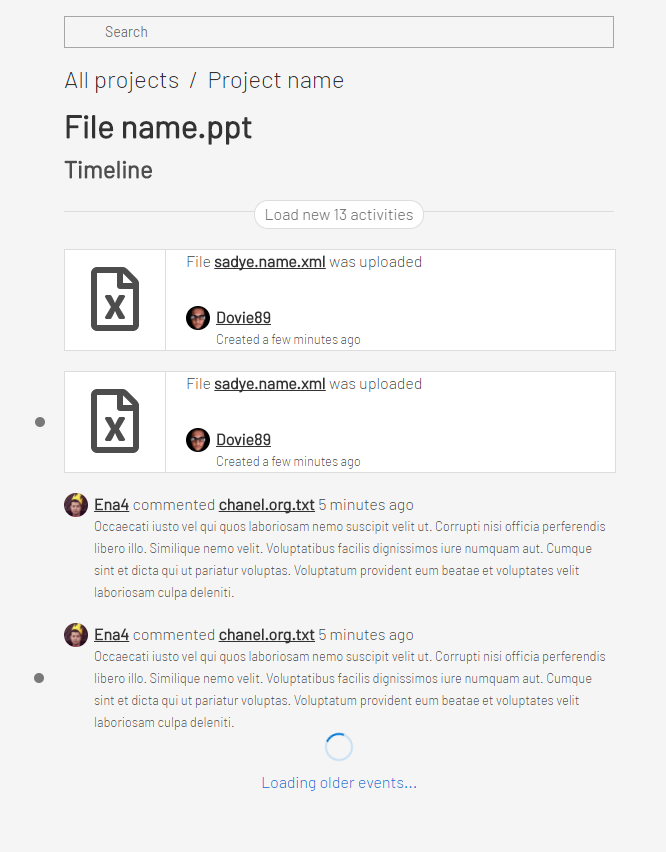

# SEMrush Timeline App (React, Redux, Redux-Saga)

## Running instructions

To run timeline app follow steps should be completed:
```
git clone
npm install
npm start
```

## Task

Your goal is to implement timeline page using provided components and API.

Feel free to use any state management library.
You can also use javascript instead of typescript.



## Timeline logic

- Every page should show the 10 latest activities.
- If user reaches the bottom of the page you should display the next 10 activities ("infinity scroll" is a preferred way, but you can implement it using "load more" button).
- You should subscribe to global timeline / timeline of opened project / file / user and collect all new activities. If there are new activities, a button "load new {} activities" should appear.
- After clicking on "load new activities" you should display the new activities at the top of the list. New activities should be marked with a dot (`highlighted` property in `Comment` and `FileIsUploaded` components).
- Flag `highlighted` should be removed after 5 second since it was in visible area.
- User can click filename and user name to navigate to particular file / user / project.
- Timeline is sorted by activity creation date from new to old.

Please, implement as much as you can.

**Important note**

You shouln't modify `/src/API/index.ts`. This file just emulates server, so you should have a really good reason to modify it. You cannot use this file as internal state.

## API

To see API usage check `src/API/usage`

Usage:
```
import * as API from '../API';

API.<resource>.entity() => Promise with resource entity
API.<resource>.getActivities(data?) => Promise with 10 activities for resource, posted before specified data
API.<resource>.subscribe(cb) => subscription // Callback cb will be called with every new activitiy in specified resource will be
```

Resource can be:
* file
* user
* timeline
* project
